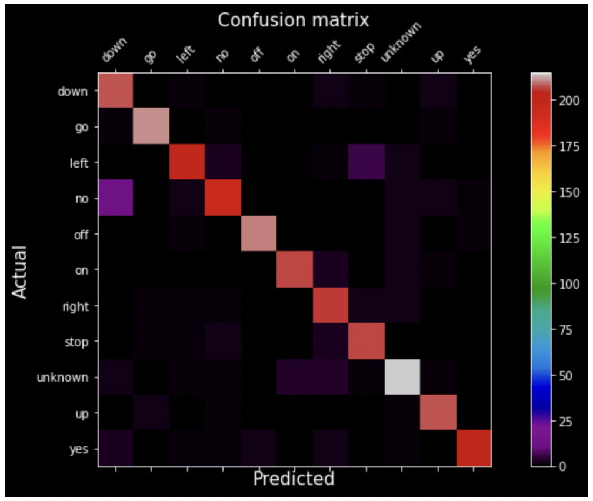

# TensorFlow Speech Recognition Challenge (TSRC_1)

### Description:

This repository contains code for constructing an algorithm that understands simple speech commands, a neural network with **EfficientNet** architecture is used as an algorithm, trained on ten classes of [competition data](https://www.kaggle.com/c/tensorflow-speech-recognition-challenge/data).

### Solution:
TSRC_1  
This is a [pytorch implementation](https://github.com/lukemelas/EfficientNet-PyTorch) neural net with architecture **EfficientNet**, by uploading pre-trained weights to the net, you can test it right from google colaboratory. TSRC_1  

### Results:
Below is a confusion matrix of validation data.

 

# TensorFlow Speech Recognition Challenge (TSRC_2)

### Description:
This notebooks aims to build a CNN + LSTM model.
It uses specgrams of wav files(rate 16000) as inputs.

### File Structure
This script assumes data are stored in following strcuture:

#### Speech

├── test

│ └── audio #test wavfiles

├── train

│ ├── audio #train wavfiles

└── model #store models

│

└── out #store sub.csv

## Improve This Script
Here are some ways to improve it's performance.

- Use audio data augmentation techniques.
- Create more 'silence' wav files using chop_audio.
- Build deeper CNN or RNN.
- Train for longer epochs

<b>pad_audio</b> will pad audios that are less than 16000(1 second) with 0s to make them all have the same length.

<b>chop_audio</b> will chop audios that are larger than 16000(eg. wav files in background noises folder) to 16000 in length. In addition, it will create several chunks out of one large wav files given the parameter 'num'.

<b>label_transform</b> transform labels into dummies values. It's used in combination with softmax to predict the label.
