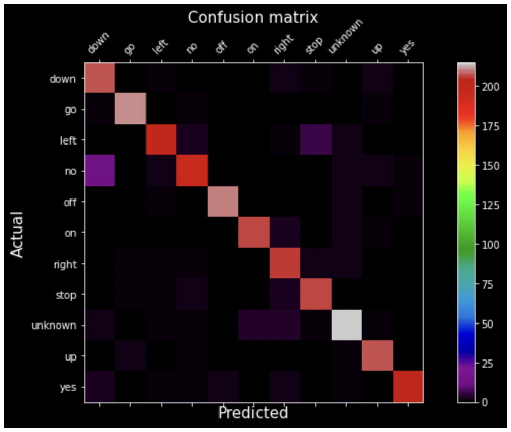

# TensorFlow Speech Recognition Challenge

### Description:

This repository contains code for constructing an algorithm that understands simple speech commands, a neural network with **EfficientNet** architecture is used as an algorithm, trained on ten classes of [competition data](https://www.kaggle.com/c/tensorflow-speech-recognition-challenge/data).

### Solution:
TSRC_2  
This is a [pytorch implementation](https://github.com/lukemelas/EfficientNet-PyTorch) neural net with architecture **EfficientNet**, by uploading pre-trained weights to the net, you can test it right from google colaboratory. TSRC_2  

### Results:
Below is a confusion matrix of validation data.

 

